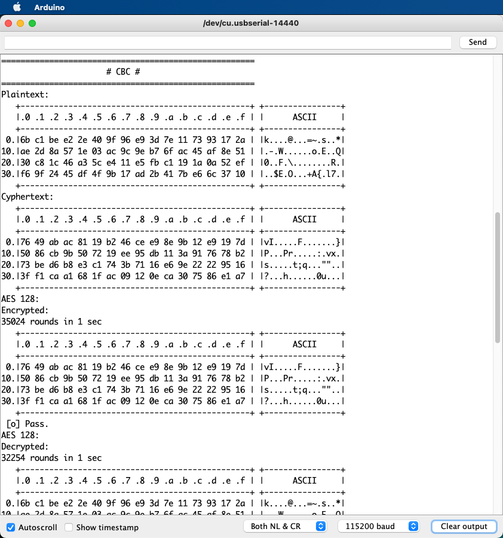
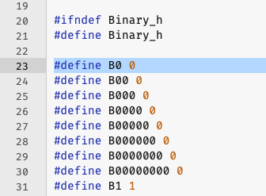
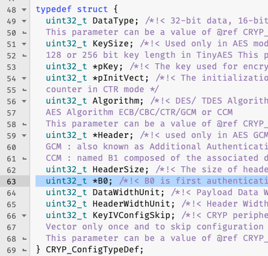

# rak3172_AES_Modes

### A port to Arduino / STM32duino of the AESModes code from STM32Cube for RAK3172, aka STM32WLE5CC

I managed to port the STM32Cube code  to Arduino / STM32duino. It wasn't easy, and I was getting a bunch of stupid errors. But after a while, I took a couple of shortcuts, and I now have AES128 working on it in Arduino. The performance is incredible. 35k rounds on 64-byte blocks. Compare with this [software AES test](https://github.com/Kongduino/RAK3172_AES_Test), which wasn't half bad. But this is an order of magnitude better.

## Caveats

### B0

For instance the `cores/arduino/binary.h` file defines binary numbers prefixed with a B, which is slightly retarded since the `0b` prefix works quite well thankyou. This conflicts with `Drivers/STM32WLxx_HAL_Driver/Inc/stm32wlxx_hal_cryp.h` and `Drivers/STM32WLxx_HAL_Driver/Src/stm32wlxx_hal_cryp.c`, where the `CRYP_ConfigTypeDef` struct has a `B0` too. Oops.

vs

So you have to rename the latter `B0` to `BB0` in `stm32wlxx_hal_cryp.*`, hoping it won't break anything else. So far so good...

### `Error_Handler`

The STM32Cube files do some voodoo stuff with 2 default `Error_Handler()` and `_Error_Handler()` defines, which are supposed to be `weak__`, but are not. I got a lot of grief with that, even after adding `weak__` in the defines. The `Error_Handler()` function in the main Arduino script was still conflicting with the original. I gave up and renamed it `myError_Handler()`. Works smoothly now...

### AES 256

It doesn't work, and the program hangs, whereas when compiled with STM32Cube it works fine. I am probably doing something wrong, maybe, but until I find out what, I'll stick to AES 128 with this one. No biggie, for me anyway, as I was trying to offer an AES 128 CBC fix for a broken implementation... :-)

I of course welcome PR and suggestions!